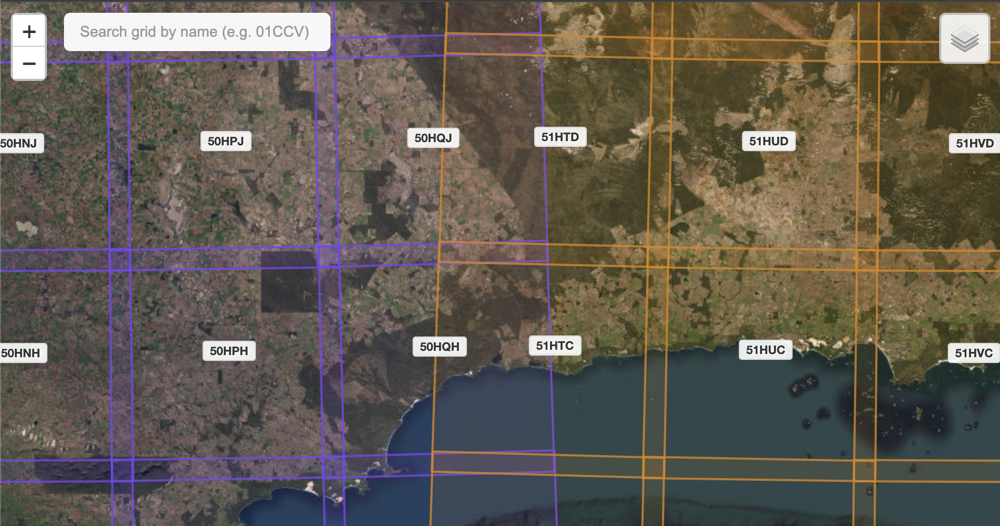

# Sentinel-2 Grid Explorer

Interactive web map for exploring Sentinel-2 satellite tile grids worldwide.

🌐 **[<ins>Check it out here!</ins>](https://dpird-dma.github.io/Sentinel-2-grid-explorer/)**

## Features

- Interactive Leaflet map with Sentinel-2 tile boundaries and no-coverage overlay
- Click-to-toggle grid selection plus shift-drag rectangle selection for bulk picking
- Smart colouring of UTM columns for quick visual differentiation
- Built-in search box with instant filtering of grid IDs
- Share panel with copyable URLs, zoom-to-selection, and GeoJSON/CSV exports
- Switchable OpenStreetMap and satellite basemaps with responsive UI

## Usage

Use the search box to jump to a grid (e.g. `01CCV`) or pan/zoom the map to explore tiles. Click tiles—or shift+drag a rectangle—to build a selection, then open the share panel to copy a link, download the selection, or zoom to it.

## License

MIT License
